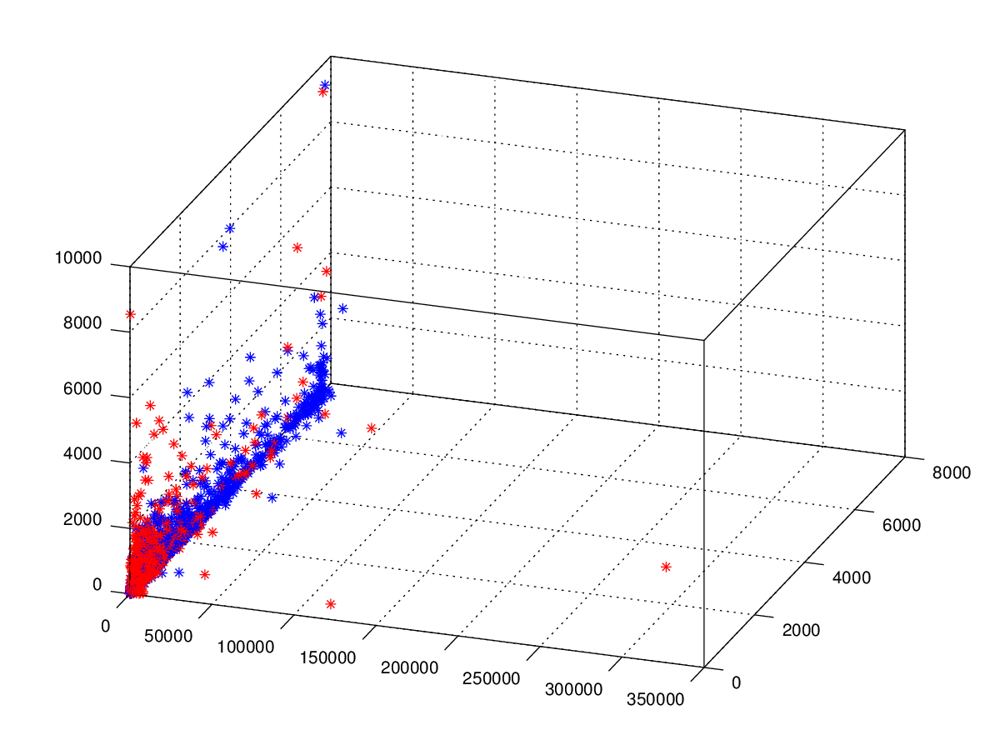

# My Machine-Learning Instagram Bot: @rowdy_the_stuffed_dog

I ran a [`finsta` @rowdy_the_stuffed_dog](https://www.instagram.com/rowdy_the_stuffed_dog) for a few months in 2015, powered by the now more restricted Instagram API, a basic logistic regression model and some pettiness (you can DM for the story). Originally posted on my old Ghost blog in June 2015, this is re-published for posterity.

!!! note "From the archive (2015)"
    I have left the content unchanged with the exception that the original D3
    widgets are now live **marimo** cells you can play with, with the figures
    restored from the
    [`rowdy-bot`](https://github.com/dmadisetti/rowdy-bot) source.
    Note: `@rowdy_the_stuffed_dog` née `rowdyb!%$#` was renamed because I've grown as a person :)

---

I wrote a machine learning Instagram bot

**Disclaimer**: I'm no longer scraping Instagram, and I'm not encouraging you to scrape Instagram; just know [the tools](http://github.com/dmadisetti/rowdy-bot) are there. In doing this, I did violate Instagram terms of service (this isn't illegal- just grounds for getting your account banned).

So what did I do exactly? Meet my dog:

## Rowdy

<figure markdown="span">
  
  <figcaption>Rowdy, ready for a night out.</figcaption>
</figure>

When we first started Rowdy's Instagram back in November 2014, it was a joke for friends. I forgot about the account until January 2015 when Spring semester started. Considering we only had 22 followers, and what was in my opinion- "quality content" - I decided to do the only logical thing to gain traction: Write an Instagram bot.

## First Iteration

A 'bot', is just a program that pretends to be human. In this instance, the bot pretended to be an Instagram user in order to gain followers.

Initially the bot was pretty simple. I set a series of hashtags and every 5 minutes the bot would like and follow people posting under a particular tag. The bot would change tags every 5 minutes until the list was over and then it would start again. I initially played with the bot changing its volume of likes throughout the day to match the account's target demographic activity level. The bot would be more active during the day and then reduce likes in the evening (based on EST). However, we found that the bot was reaching an audience in Japan and Australia, so there was no point restraining the bot. To maintain what we thought was a reasonable follower, following ratio, we came up with a pretty nifty function:

$$x\,e^{\,x\frac{\ln(\text{magic})}{\text{target}}}$$

The function itself is pretty simple. It's dependent on 2 user set variables, `magic` and `target`. Magic is the ratio that the follower to following ratio should be at target. For instance: if `magic = 0.75` and `target = 1000` then at 1000 followers, the bot should be following 75% of its followers or 750 people. This function allowed us to find the sweet spot between following people and being followed at a gradual and smooth rate. Play with the function yourself below.

```python {.marimo hide="true"}
import marimo as mo
import numpy as np
import altair as alt
import pandas as pd

magic = mo.ui.slider(0.05, 1.0, value=0.75, step=0.05, label="magic — target follow-back ratio")
target = mo.ui.slider(100, 3000, value=1000, step=100, label="target — followers")
mo.hstack([magic, target], justify="start", gap=2)
```

```python {.marimo hide="true"}
_x = np.linspace(0, 2 * target.value, 400)
_following = _x * np.exp(_x * np.log(magic.value) / target.value)
_curve = pd.DataFrame({"followers": _x, "following": _following})
_line = alt.Chart(_curve).mark_line(color="#268bd2").encode(
    x=alt.X("followers:Q", title="followers (x)"),
    y=alt.Y("following:Q", title="following the bot maintains"),
)
_goal = pd.DataFrame({"followers": [target.value], "following": [magic.value * target.value]})
_dot = alt.Chart(_goal).mark_point(color="#dc322f", size=90, filled=True).encode(
    x="followers:Q", y="following:Q",
)
mo.vstack([
    (_line + _dot).properties(height=320, width="container"),
    mo.md(
        f"At **{target.value:,} followers** the bot holds at "
        f"**{int(magic.value * target.value):,} following** — a {magic.value:.0%} ratio (the red dot)."
    ),
])
```

## Second Iteration

Rowdy did really well. A little after a month, we passed 1000 followers. His growth seemed to be linear and reliable. I'd check the account casually throughout the week, rarely posting; yet his numbers seemed to grow at an average of 32 followers a day. I'd tweak the hashtags every couple weeks and let the bot do its business.

> This data isn't perfect, the bot went down for an age without us realizing it (in addition to other hiccups)- but the general trend is there

I'd been brewing on the idea of turning Rowdy into a machine learning project for awhile, and during a relative lull in school work, I expanded rowdy-bot to be [machine learning](https://en.wikipedia.org/wiki/Machine_learning) (capable of making intelligent decisions based on statistical data). At this point, I decided there was enough training data that we could model the accounts Rowdy interacted with. So I set up the bot to asynchronously download and process Instagram data. Here's a little visualization of what we found:



> Axes are Followers, Following, Posts (X,Y,Z) where blue dots are the bot's followers (the good guys) and red dots are the folks who don't follow the bot back (the bad guys). This distinction was chosen because those who don't follow back are accounts the bot should actively attempt to stay away from.

My first impression was: **Hey. The different types of accounts look separable**. So using gradient descent, I came up with an *OK* logistic regression model, that was capable of correctly guessing 70% of the test set data.

In addition to recognizing potential followers, a smarter bot should be able to choose its own hashtags for finding and following people. To do this, I played with the [PageRank algorithm](https://en.wikipedia.org/wiki/PageRank) (what Google used to use for ranking webpages). PageRank takes the number of connections linked to a webpage and creates a score for the webpage. The higher the score, the higher the webpage ranking. In my implementation, I counted a 'connection' as concurrent hashtag use in a post. For instance if a post used the hashtags \[`#lol`,`#omg`,`#selfie`,`#love`\] then a connection was made between each of the tags. The more connections to a hashtag means a higher score, but the more connections total, means less value per connection. There's a little bit more to the algorithm, but that's the gist. Play around with the idea below for some intuition (bigger size means better ranking):

```python {.marimo hide="true"}
good_love = mo.ui.slider(0, 50, value=40, label="#love connections")
good_omg = mo.ui.slider(0, 50, value=20, label="#omg connections")
good_selfie = mo.ui.slider(0, 50, value=35, label="#selfie connections")
good_dog = mo.ui.slider(0, 50, value=25, label="#dog connections")
good_beauty = mo.ui.slider(0, 50, value=30, label="#beauty connections")
mo.vstack([good_love, good_omg, good_selfie, good_dog, good_beauty])
```

```python {.marimo hide="true"}
_tags = ["#love", "#omg", "#selfie", "#dog", "#beauty"]
_conns = np.array(
    [good_love.value, good_omg.value, good_selfie.value, good_dog.value, good_beauty.value],
    dtype=float,
)
# More connections to a tag lifts its score, but more connections *overall* means
# each one is worth less — so normalise by the total.
_rank = _conns / (_conns.sum() or 1.0)
_df_good = pd.DataFrame({"hashtag": _tags, "rank": _rank})
alt.Chart(_df_good).mark_bar(color="#268bd2").encode(
    x=alt.X("rank:Q", title="page-rank score"),
    y=alt.Y("hashtag:N", sort="-x", title=None),
).properties(height=180, width="container")
```

My alteration of PageRank first ranked hashtags used by accounts that followed Rowdy (the good guys) within a 3 hour time period. This allowed us to see what tags were trending among Rowdy's followers and led the bot to better hashtags. We quickly found out that this train of thought was flawed. Some hashtags on Instagram just have an extremely high volume. As such, the algorithm found hashtags that were not particular to Rowdy's followers, but hashtags that were just popular in general. To fix this, I ranked the hashtags used by 'those who Rowdy followed but didn't follow back' (the bad guys) and then **subtracted** these values from the other ranking. I was pleased to see this worked pretty well. `#dog` ranked pretty well, in addition to some of the values I saw before, like `#love` and `#beauty`. However certain high ranking tags like `#selfie` now had a negative value. I was really pleased with that. Try it out for yourself (The positive values are taken from the sliders above. If it's red, then it has a negative value):

```python {.marimo hide="true"}
bad_love = mo.ui.slider(0, 50, value=10, label="#love bad connections")
bad_omg = mo.ui.slider(0, 50, value=15, label="#omg bad connections")
bad_selfie = mo.ui.slider(0, 50, value=40, label="#selfie bad connections")
bad_dog = mo.ui.slider(0, 50, value=5, label="#dog bad connections")
bad_beauty = mo.ui.slider(0, 50, value=8, label="#beauty bad connections")
mo.vstack([bad_love, bad_omg, bad_selfie, bad_dog, bad_beauty])
```

```python {.marimo hide="true"}
_g = np.array(
    [good_love.value, good_omg.value, good_selfie.value, good_dog.value, good_beauty.value],
    dtype=float,
)
_b = np.array(
    [bad_love.value, bad_omg.value, bad_selfie.value, bad_dog.value, bad_beauty.value],
    dtype=float,
)
# Good connections add +1/Σgood each; bad connections subtract 1/Σbad each — the
# net is what actually steered the bot toward tags its real followers used.
_net = _g / (_g.sum() or 1.0) - _b / (_b.sum() or 1.0)
_df_net = pd.DataFrame(
    {"hashtag": ["#love", "#omg", "#selfie", "#dog", "#beauty"], "rank": _net}
)
alt.Chart(_df_net).mark_bar().encode(
    x=alt.X("rank:Q", title="page-rank score (good − bad)"),
    y=alt.Y("hashtag:N", sort="-x", title=None),
    color=alt.condition(alt.datum.rank < 0, alt.value("#dc322f"), alt.value("#268bd2")),
).properties(height=180, width="container")
```

Now the bot was '*smart*', it started averaging around 100 new followers a day. It was also averaging several thousand API requests to fuel its decisions. The bot got a bit too greedy with the number of requests it was making, and Instagram shut it down. Ultimately, it was completely fine. Using a bot was technically wrong. It was just really fun. It was a great learning experience and I felt as if it was worth it. We got cut off at 3700 followers.

If I had to do it again, there are certain things I might reconsider:

- Instead of finding potential followers by hashtags, find out what accounts your followers follow and determine if they meet your model. I imagine this would reduce the chance the bot finds spam accounts, and would be more likely to find new followers closer to the existing model.

- Be more scientific. Sure- there is some data, but really nothing was controlled. I can't really say it was the follower modeling or the hashtag ranking that made the bot better. I can't really determine what leads to accounts following in the first place. To make the bot better: collecting more data and stricter control of the environment would be a must.

- Incorporate computer vision. Instagram is a social media outlet based on images! I completely ignored what was probably very valuable data. I can imagine running some sort of unsupervised feature detection to create parameters I could then use in my model.
