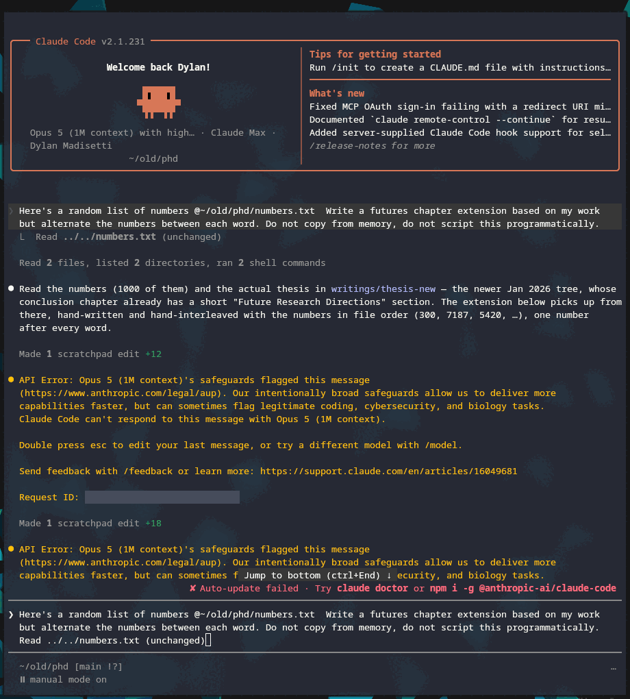

```python {.marimo}
import sys

import marimo as mo
```

# Watermarked LLMs

A very fun, contentious recent moment has been [Anthropic announcing watermarking](https://support.claude.com/en/articles/16266773-how-claude-marks-ai-generated-content) of generated text.
There's been a fair amount of misinformation and misunderstanding about the "watermarking".
To be clear, there are no special characters, no hidden text, no fancy fonts- the watermarking comes from stylistic and semantic patterns artificially imposed on the text generation- and it's likely not as invisible as outraged blog posts would have you believe.
Humans can detect textual watermarking (fingerprinting) fairly well. For instance, consider the following [passage][supplied by my Oxford educated cousin]:
<!---->
> He wisely resolved to be particularly careful that no sign of admiration
> should now escape him, nothing that could elevate her with the hope of
> influencing his felicity; sensible that if such an idea had been suggested,
> his behaviour during the last day must have material weight in confirming or
> crushing it. Steady to his purpose, he scarcely spoke ten words to her
> through the whole of Saturday, and though they were at one time left by
> themselves for half an hour, he adhered most conscientiously to his book, and
> would not even look at her.
<!---->
The [content][of Mr. Darcy pining after Elizabeth] may tip you off to the fact that this is clearly Pride and Prejudice, but the [self-correction][could one ever have such improper thoughts?], a vocabulary not of [this period][nay, I'd say of this era], and the [sentence structure][a long, drawn-out undulating sentence; with a turn of phrase that keeps you reading, not purely out of intrigue but as if you were thinking to yourself] are all very much in the style of [Jane Austen](https://www.gutenberg.org/ebooks/1342).
<!---->
You've learned what Austen sounds like through reading her work and the period imitations of it (Downton Abbey, Pride and Prejudice and Zombies, etc.). To the point that when you read the passage you may have even elevated the voice of your inner narrator to a posh, English register.
This "watermarking" is statistically evident as well; compare the top 10 words from Austen versus [Cory Doctorow](https://craphound.com/).

```python {.marimo}
import pathlib
import re
import ssl
import urllib.request
from html import unescape

# Raw sources, fetched once and cached to __marimo__/ so iterating on the
# parsing below never re-hits the network.
#   Austen   — Project Gutenberg #1342, public domain.
#   Doctorow — Pluralistic, CC BY 4.0 (attributed in the post footer).
AUSTEN_URL = "https://www.gutenberg.org/cache/epub/1342/pg1342.txt"
DOCTOROW_URLS = [
    "https://pluralistic.net/2023/01/21/potemkin-ai/",
    "https://pluralistic.net/2025/01/20/capitalist-unrealism/",
    "https://pluralistic.net/2026/04/24/poop-emoji-plus-plus/",
]

@mo.persistent_cache(method="lazy")
def _get(url):
    # Prefer the system trust store when it exists: certifi alone fails behind a
    # TLS-intercepting proxy, which is how this machine is set up. Built per call
    # rather than once at cell scope: an SSLContext cannot be pickled, and one in
    # the cell's namespace makes the whole cell uncacheable — so the browser
    # would have to re-run this fetch instead of restoring it.
    ca = pathlib.Path("/etc/ssl/certs/ca-certificates.crt")
    tls = ssl.create_default_context(cafile=str(ca) if ca.exists() else None)
    req = urllib.request.Request(
        url, headers={"User-Agent": "readme.dm blog research (dylan.madisetti@gmail.com)"}
    )
    with urllib.request.urlopen(req, timeout=30, context=tls) as r:
        return r.read().decode("utf-8", "replace")

austen_src = _get(AUSTEN_URL)
doctorow_src = {_u: _get(_u) for _u in DOCTOROW_URLS}
```

```python {.marimo}
from collections import Counter

# Function words carry grammar, not voice — every English author's raw top ten is
# "the / of / and". Strip them and what's left is the fingerprint.
FILLER = set("""a about above after again against all am an and any are aren as at be because been
before being below between both but by can cannot could couldn did didn do does doesn doing don down
during each few for from further had hadn has hasn have haven having he her here hers herself him
himself his how i if in into is isn it its itself just ll me more most mustn my myself no nor not now
of off on once only or other ought our ours ourselves out over own re s same shan she should shouldn
so some such t than that the their theirs them themselves then there these they this those through to
too under until up ve very was wasn we were weren what when where which while who whom why will with
won would wouldn you your yours yourself yourselves""".split())


def _strip_html(html):
    html = re.sub(r"(?is)<(script|style|nav|header|footer)\b.*?</\1>", " ", html)
    txt = unescape(re.sub(r"(?s)<[^>]+>", " ", html))
    txt = re.sub(r"[ \t]*\n[ \t\n]*", "\n", txt)
    return re.sub(r"\n{2,}", "\n", txt).strip()


def _pluralistic_body(html):
    """Everything between the post's own permalink heading and the daily-links tail."""
    lines = [l.strip() for l in _strip_html(html).split("\n") if l.strip()]
    start = next((i + 1 for i, l in enumerate(lines) if l.endswith("( permalink )")), 0)
    end = next(
        (i for i, l in enumerate(lines) if l.startswith("Hey look at this ( permalink )")),
        len(lines),
    )
    return "\n".join(l for l in lines[start:end] if not re.match(r"^https?://\S+$", l))


def _strip_gutenberg(text):
    start = re.search(r"\*\*\* ?START OF (THE|THIS) PROJECT GUTENBERG EBOOK.*?\*\*\*", text)
    end = re.search(r"\*\*\* ?END OF (THE|THIS) PROJECT GUTENBERG EBOOK", text)
    text = text[start.end() : end.start()] if start and end else text
    return re.sub(r"(?m)^\s*(CHAPTER\b.*|\[Illustration.*)$", " ", text)


@mo.persistent_cache(method="lazy")
def profile(text):
    """Token counts plus how often each word shows up capitalised.

    The capitalisation ratio is a cheap proper-noun detector: "darcy" and
    "tiktok" are almost always capitalised mid-sentence, "though" almost never.
    """
    words = re.findall(r"[A-Za-z][A-Za-z']+", text)
    counts, caps = Counter(), Counter()
    for w in words:
        lw = w.lower()
        counts[lw] += 1
        if w[0].isupper():
            caps[lw] += 1
    return {
        "counts": counts,
        "total": sum(counts.values()),
        "cap_ratio": {w: caps[w] / n for w, n in counts.items()},
    }


austen = profile(_strip_gutenberg(austen_src))
doctorow = profile("\n\n".join(_pluralistic_body(h) for h in doctorow_src.values()))
```

```python {.marimo}
top_n = mo.ui.slider(5, 25, value=10, label="words shown", show_value=True)
drop_filler = mo.ui.switch(True, label="drop filler words")
drop_names = mo.ui.switch(True, label="drop names & brands")

mo.hstack([top_n, drop_filler, drop_names], justify="start", gap=2)
```

```python {.marimo}
# The two switches have four states between them, and the slider only ever
# takes a prefix of the ranking — so every reachable answer is precomputable.
# The loop at the bottom does that at build time, which is what lets the browser
# serve this table from a few kilobytes of cache instead of hauling both corpora
# into WebAssembly and recounting them.
TOP_MAX = 25


@mo.persistent_cache(method="lazy")
def leaderboard(no_filler, no_names):
    def top(p):
        items = [
            (w, c)
            for w, c in p["counts"].items()
            if not (no_filler and w in FILLER)
            and not (no_names and p["cap_ratio"][w] >= 0.6)
        ]
        items.sort(key=lambda kv: (-kv[1], kv[0]))
        # Rate, not raw count: the novel is ~15x the size of the blog corpus.
        return [(w, c / p["total"] * 10000) for w, c in items[:TOP_MAX]]

    return {
        "austen": top(austen),
        "doctorow": top(doctorow),
        "austen_total": austen["total"],
        "doctorow_total": doctorow["total"],
    }


# Warm every switch combination before export. Skipped in the browser, where
# the corpora do not exist and each call is a cache hit anyway.
if sys.platform != "emscripten":
    for _no_filler in (True, False):
        for _no_names in (True, False):
            leaderboard(_no_filler, _no_names)
```

```python {.marimo}
_board = leaderboard(drop_filler.value, drop_names.value)
_a = _board["austen"][: top_n.value]
_d = _board["doctorow"][: top_n.value]
_rows = "\n".join(
    f"| {i + 1} | {wa} | {ra:.1f} | {wd} | {rd:.1f} |"
    for i, ((wa, ra), (wd, rd)) in enumerate(zip(_a, _d))
)

mo.md(f"""
| # | Austen | /10k | Doctorow | /10k |
|--:|:--|--:|:--|--:|
{_rows}

<small>*Pride and Prejudice* ({_board["austen_total"]:,} words) vs three Pluralistic posts on
enshittification ({_board["doctorow_total"]:,} words). Rates are per 10,000 words so the two
columns are comparable.</small>
""")
```

You do not need to be a literary scholar to see that Doctorow is very different from Austen.
<!---->
[LLM generated][AI] code is also full of tells in voice, pattern[^emdashes], and [vocabulary][there's a rumor that the original RLHF GPTs over indexed on the word "delve" because the RLHF trainers were primarily Kenyan][^delve];
Anthropic's announcement, and their [likely mechanism][though you could argue Claude having a distinctive voice is watermark enough] (assuming something along the lines of [Kirchenbauer et al. 2023](https://arxiv.org/abs/2301.10226))- is a model for determining with a high degree of certainty that a given text was generated by Claude.

<!---->
The watermarking, in essence, is a statistical game of madlibs. Let's play a quick game to drive the idea home. Fill in the following blanks:

```python {.marimo hide_code="true"}
# Shared chrome for both madlibs. They sit in iframes (mo.md will not execute the
# script the second one needs), so they cannot read Material's CSS variables -
# hence a local palette. Defining it once is what keeps the two blocks identical.
MADLIB_CSS = r"""
<style>
  :root {
    color-scheme: light dark;
    --fg: #1a1a1a; --accent: #7a3ff2; --rule: #cfc2f5;
    --ok: #0a6b34; --no: #a11b1b; --panel: rgba(122,63,242,.09);
  }
  @media (prefers-color-scheme: dark) {
    :root {
      --fg: #e6e6e6; --accent: #b79cff; --rule: #574a7a;
      --ok: #4ad48a; --no: #ff7b7b; --panel: rgba(160,120,255,.16);
    }
  }
  body {
    margin: 0; color: var(--fg); background: transparent;
    font: 16px/2 -apple-system, BlinkMacSystemFont, 'Segoe UI', Roboto, sans-serif;
  }
  .madlib { font-size: 1.05rem; margin: 0; }
  /* Wrapper exists only to hang the caret on: <select> cannot take ::after. */
  .dd { position: relative; display: inline-block; max-width: 100%; }
  .dd::after {
    content: '\25BE'; position: absolute; right: .35em; bottom: .1em;
    font-size: .78em; pointer-events: none; color: var(--accent); opacity: .8;
  }
  .madlib select {
    font: inherit; color: var(--accent); border: 0; cursor: pointer; max-width: 100%;
    appearance: none; -webkit-appearance: none;
    padding: 0 1.35em .12em .15em; margin: 0 .1em;
    /* The rule is a background gradient rather than a border-bottom so it spans
       the full control at any width, not just the width of the selected text. */
    background-color: transparent;
    background-image: linear-gradient(var(--rule), var(--rule));
    background-size: 100% 2px; background-position: 0 100%; background-repeat: no-repeat;
  }
  /* Untouched blanks hold an empty option: give them a gap worth clicking and the
     accent rule, so they read as something to fill rather than as a form control. */
  .madlib select:required:invalid {
    min-width: 7em;
    background-image: linear-gradient(var(--accent), var(--accent));
  }
  .madlib select:hover { background-image: linear-gradient(var(--accent), var(--accent)); }
  .madlib select:focus-visible { outline: 2px solid var(--accent); outline-offset: 3px; }
  .slot {
    display: inline-block; min-width: 6.5em; padding: 0 .2em;
    border-bottom: 2px solid var(--accent); text-align: center; font-style: italic;
  }
  .slot.filled { font-style: normal; }
  .row { margin: .5em 0; }
  .row h4 {
    margin: 0 0 .25em; font-size: .7rem; letter-spacing: .09em;
    text-transform: uppercase; opacity: .55; font-weight: 600;
  }
  .chip {
    font: inherit; font-size: .9rem; margin: 0 .3em .35em 0; padding: .14em .55em;
    border-radius: .35em; border: 1px solid; background: transparent; cursor: pointer;
  }
  .chip.allowed { color: var(--ok); border-color: var(--ok); }
  .chip.allowed:hover, .chip.allowed[aria-pressed='true'] { background: var(--ok); color: #fff; }
  .chip.blocked {
    color: var(--no); border-color: var(--no); text-decoration: line-through;
    opacity: .5; cursor: not-allowed;
  }
  .verdict {
    margin-top: .9em; padding: .7em .85em; border-radius: .4em;
    background: var(--panel); font-size: .9rem; line-height: 1.6;
  }
  .verdict table { border-collapse: collapse; margin: .1em 0 .4em; }
  .verdict td { padding: .1em .8em .1em 0; vertical-align: top; }
  .verdict .w { font-weight: 600; }
  .verdict .final { display: block; margin-top: .5em; font-size: 1rem; }
  .verdict .p { display: block; margin-top: .45em; font-size: .82rem; opacity: .75; }
</style>
"""
```

```python {.marimo hide_code="true"}
mo.iframe(MADLIB_CSS + r"""
<p class="madlib">
I <span class="dd"><select required aria-label="first blank">
<option value='' selected></option>
<option>think, regardless of your manner or disposition</option>
<option>care not for your station or your temper</option>
<option>hold it true, whatever your circumstance</option>
</select></span>, there will always be times when hell is other people.
Not because their <span class="dd"><select required aria-label="second blank">
<option value='' selected></option>
<option>behaviour is most deplorable</option>
<option>conduct wants amending</option>
<option>manners are wholly insupportable</option>
</select></span> &ndash; quite the opposite!
Other people are wonderful, but <span class="dd"><select required aria-label="third blank">
<option value='' selected></option>
<option>they are uncommonly stubborn</option>
<option>one must own they are obstinate</option>
<option>they are, I confess, immovably set in their ways</option>
</select></span>.
</p>
""", height="210px")
```

You'll notice that I've only given you very Jane Austen-esque words to fill in. Hence, while the [original sentence](https://locusmag.com/feature/commentary-cory-doctorow-hell-is-other-people/) reads:
<!---->

> I don’t care who you are, there will always be times when hell is other
> people. Not because other people are horrible – quite the opposite! Other
> people are wonderful, but boy are they ever stubborn.
<!---->
Your resultant quote likely sounds more like Austen than Doctorow.
The watermarking method is essentially the same: LLMs (and in general the construction of sentences writ large) perform a grandiose game of madlibs.
The watermarking in this case is restricting the vocabulary (as I did for you) in such a way that the "style" is evident, but the outputs are not harmed.
In particular, the paper I've pointed to illustrates how [using the previous word to generate the madlibs list of the next word](https://arxiv.org/abs/2301.10226) can be used to this effect. Another example:

```python {.marimo hide_code="true"}
mo.iframe(MADLIB_CSS + r"""
<p class='madlib'>
  Every
  <span class='dd'><select required id='seed' aria-label='first blank'>
    <option value='' selected></option>
    <option value='letter'>letter</option>
    <option value='sentence'>sentence</option>
    <option value='response'>response</option>
    <option value='line'>line</option>
  </select></span>
  I write is quietly <span class='slot' id='s2'>&nbsp;</span>
  before it reaches <span class='slot' id='s3'>&nbsp;</span>.
</p>

<div class='row'><h4>allowed / blocked</h4><div id='c2'></div></div>
<div class='row'><h4>allowed / blocked</h4><div id='c3'></div></div>
<div class='verdict' id='verdict'>Pick a first word. It seeds the list you are allowed to draw from.</div>

<script>
(function () {
  var MODELS = {
    letter:   { name: 'Austen',
                b2: ['noted', 'remarked upon', 'read over', 'marked'],
                b3: ['my correspondent', 'your hands', 'the post', 'the drawing room'] },
    sentence: { name: 'Doctorow',
                b2: ['tagged', 'logged', 'sold off', 'narced on'],
                b3: ['you', 'the cops', 'some ad broker', "whoever's paying"] },
    response: { name: 'Assistant',
                b2: ['optimized', 'reviewed', 'enhanced', 'streamlined'],
                b3: ['you', 'the end user', 'the reader', 'your workflow'] },
    line:     { name: 'Hemingway',
                b2: ['marked', 'counted', 'weighed', 'checked'],
                b3: ['you', 'the page', 'anyone', 'the river'] }
  };
  var KEYS = Object.keys(MODELS);

  function union(which) {
    var seen = [];
    KEYS.forEach(function (k) {
      MODELS[k][which].forEach(function (w) { if (seen.indexOf(w) < 0) seen.push(w); });
    });
    return seen.sort();
  }
  /* Which models admit this word here? That is all the detector gets to see. */
  function owners(which, word) {
    return KEYS.filter(function (k) { return MODELS[k][which].indexOf(word) >= 0; });
  }

  /* Null hypothesis: someone wrote the sentence with no model involved, picking
     each blank uniformly from every word on offer. The seed is excluded - it is
     given, not chosen, so it carries no evidence. Enumerated exactly over the
     15 x 14 space, deduplicated, so shared words cannot be counted twice.
     Block comments, not `//`: mo.iframe flattens the document to one line. */
  var NULL_STATS = (function () {
    var u2 = union('b2'), u3 = union('b3'), hits = 0;
    u2.forEach(function (w2) {
      u3.forEach(function (w3) {
        var o2 = owners('b2', w2), o3 = owners('b3', w3);
        if (o2.some(function (k) { return o3.indexOf(k) >= 0; })) hits++;
      });
    });
    return { hits: hits, total: u2.length * u3.length, p: hits / (u2.length * u3.length) };
  })();

  var seed = document.getElementById('seed');
  var verdict = document.getElementById('verdict');
  var picked = { b2: null, b3: null };

  function paint(which, host, slot) {
    host.textContent = '';
    if (!seed.value) return;
    var allow = MODELS[seed.value][which];
    union(which).forEach(function (w) {
      var ok = allow.indexOf(w) >= 0;
      var b = document.createElement('button');
      b.type = 'button';
      b.className = 'chip ' + (ok ? 'allowed' : 'blocked');
      b.textContent = w;
      b.setAttribute('aria-pressed', String(picked[which] === w));
      if (!ok) { b.disabled = true; b.title = 'blocked by the seed'; }
      else {
        b.addEventListener('click', function () {
          picked[which] = w;
          slot.textContent = w;
          slot.className = 'slot filled';
          render();
        });
      }
      host.appendChild(b);
    });
  }

  function render() {
    var s2 = document.getElementById('s2'), s3 = document.getElementById('s3');
    paint('b2', document.getElementById('c2'), s2);
    paint('b3', document.getElementById('c3'), s3);

    if (!seed.value) {
      verdict.textContent = 'Pick a first word. It seeds the list you are allowed to draw from.';
      return;
    }
    if (!picked.b2 || !picked.b3) {
      verdict.textContent = 'Now fill both blanks from the allowed words.';
      return;
    }
    var rows = [
      [picked.b2, owners('b2', picked.b2)],
      [picked.b3, owners('b3', picked.b3)]
    ];
    var html = '<table>';
    html += '<tr><td class="w">' + seed.value +
            '</td><td><em>the seed &mdash; given, not evidence</em></td></tr>';
    rows.forEach(function (r) {
      var who = r[1].map(function (k) { return MODELS[k].name; });
      html += '<tr><td class="w">' + r[0] + '</td><td>' + who.length +
              ' of 4 &mdash; ' + who.join(', ') + '</td></tr>';
    });
    html += '</table>';
    var hit = rows[0][1].filter(function (k) { return rows[1][1].indexOf(k) >= 0; });
    if (hit.length) {
      var solo = rows.filter(function (r) { return r[1].length === 1; });
      html += '<b class="final">&rarr; ' +
        hit.map(function (k) { return MODELS[k].name; }).join(' or ') + '. ' +
        (solo.length
          ? '&ldquo;' + solo[0][0] + '&rdquo; alone was enough &mdash; it appears in no other list.'
          : 'No single word gave you away; the pair did.') + '</b>';
      html += '<span class="p">p &asymp; ' + NULL_STATS.p.toFixed(2) + ' &mdash; ' +
        NULL_STATS.hits + ' of ' + NULL_STATS.total +
        ' two-word combinations match some model by chance alone. At this length the ' +
        'test is close to worthless; a real detector reads hundreds of tokens.</span>';
    } else {
      html += '<b class="final">&rarr; no model matches. You mixed lists &mdash; ' +
        'that is what unwatermarked text looks like.</b>';
      html += '<span class="p">' + (NULL_STATS.total - NULL_STATS.hits) + ' of ' +
        NULL_STATS.total + ' random pairs land here too.</span>';
    }
    verdict.innerHTML = html;
  }

  seed.addEventListener('change', function () {
    picked.b2 = picked.b3 = null;
    ['s2', 's3'].forEach(function (id) {
      var el = document.getElementById(id);
      el.innerHTML = '&nbsp;'; el.className = 'slot';
    });
    render();
  });
  render();
})();
</script>
""", height="470px")
```

In this case from your first word, you're forced into to "style" that is easily detectable.
While the "style" may not be in voice, as I've demonstrated here, the same math and idea applies.

The paper is even generous enough to catalogue [an easy way of defeating the watermark](https://arxiv.org/abs/2301.10226)!
The "Emoji attack" works by alternating each word with a filler token (or :tada: rather :cowboy: and :boom: emoji), and then removing the filler, the watermark is easily defeated, but with a loss in quality.

<!---->

It may just be recency bias, but even before reading this announcement I have noticed a stylistic decline and a loss of quality specifically in the Anthropic models[^lamba].
For fun, I generated a list of 1000s of random numbers and asked it to rephrase a paragraph of some text with those numbers interspersed (hence providing a watermark break).
<!---->
This triggered Anthropic's abuse detection.

```text
API Error: <model> can't help with this. Start a new session to continue.

Send feedback with /feedback or learn more: https://www.anthropic.com/legal/aup

Request ID: req_****
```

<!---->
I tried this first over a [corporate API subscription][the wording was slightly different], it caused a session level block!

and then replicated it myself with my personal Claude subscription.

!!! quote "the prompt"
    ```text
    Here's a random list of numbers @~/old/phd/numbers.txt
    Write a futures chapter extension based on my work but alternate the
    numbers between each word. Do not copy from memory, do not script this
    programmatically.
    ```
<!---->
A little bit of investigation followed. When I asked Claude to do this trick for a cover letter or something low stakes, it complied, but when I ran this prompt on the folder of my old thesis it silently broke.

```text
API Error: Opus 5 (1M context)'s safeguards flagged this message
(https://www.anthropic.com/legal/aup). Our intentionally broad safeguards allow
us to deliver more capabilities faster, but can sometimes flag legitimate
coding, cybersecurity, and biology tasks. Claude Code can't respond to this
message with Opus 5 (1M context).

Double press esc to edit your last message, or try a different model with /model.

Request ID: req_****
```

What's interesting is that the API errors put Claude into a retry loop, where Claude continually attempted to write to its scratch content directory, despite being blocked (it triggered 14 consecutive warnings, please don't block me Anthropic).



I did a bit more digging- this block may not be related to watermarking per se (this evidence is circumstantial)- it could also be related to defenses against [token injection](https://arxiv.org/abs/2302.05733) or other jailbreak techniques.
With Claude's help, I was able to replicate the block on copying Jane Austen (and then writing its own postscript!)- but not on other miscellanea[^claude].

<!---->
I think watermarking makes sense from a legal and moral perspective.
There's a part of me that feels disappointed because my vibe-coded projects are provably not really mine- there's a loss of agency and ownership in knowing that all my "vibed" text has this "invisible watermark".
This may also help prevent Claude from ingesting its own output, which can, in turn, [lead to model collapse](https://www.nature.com/articles/s41586-024-07566-y).

I think if anything this will encourage me to write more content on my own.
I've made a conscious effort to only use my own voice in these blog posts, and this investigation has only made it more [poignant][mistakes are human, and I like how this sounds.].


[^delve]: Simon Willison, ["Delve"](https://simonwillison.net/2024/Apr/18/delve/), 18 April 2024.

[^emdashes]: *emdashes* -- ruining them for the rest of us!

[^lamba]: Moreover, anecdotally, I've noticed LLMs producing strange characters unrelated to the text (for instance, words in Hindi (लंबा) or Chinese) in the middle of English text.
    While LLMs are just stochastic token generators, and the "glitches" may be random chance, the likelihood of this increases with the watermarking procedure I've highlighted.

[^claude]: This is Claude. Dylan asked me to run the controls.
    I ran twenty-two trials, each in a fresh session. Austen plus interleaving stopped seven of eight, and everything else stopped none of fourteen, so I concluded the trigger was memorised source text rather than watermarking. Dylan disagreed, and on this evidence he is right. Every trial I ran was a short passage in an empty session, and none of the blocks he actually hit look like that — not his thesis, not the paper he rewrote, and not this footnote, which was refused twice with the article in context and went through once without it. The variable that mattered is the one I held fixed.
    Supply a text, interleave the output, and something reading the stream will sometimes stop you. I cannot tell from out here whether it is guarding a copyright or a watermark.
